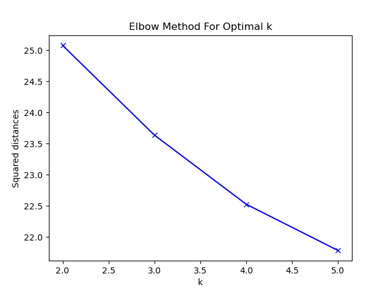
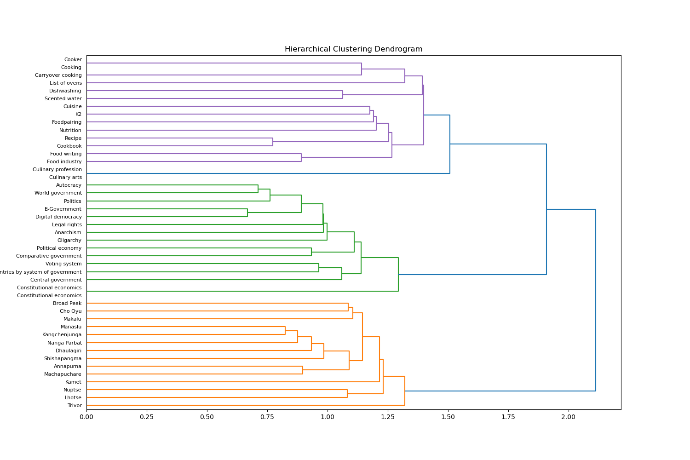

# **Лабораторная работа №4**

## Задание

* Установить библиотеки wikipedia, scipy.
* Найти список статей англоязычной Википедии по темам согласно варианту (минимум 15 статей по каждой теме) и записать в отдельный массив.
* Получить тест статей (документ) и записать в отдельный массив.
* Извлечь фичи из текстов на английском языке с помощью TF-IDF (признаки).
* Определить число кластеров с помощь elbow метода и нарисовать график.
* Разбить массив признаков на кластеры с помощью алгоритмов KMeans, MiniBatchKMeans, DBSCAN и вывести результат работы алгоритмов в консоль.
* Разбить массив признаков на кластеры с помощью иерархической кластеризации (из библиотеки scipy) и представить результат в виде дендрограммы.

### Вариант 4: Mountains, Cooking, Government

## Графики

### Метод локтя

### Дендрограмма

